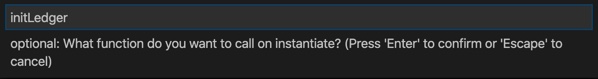
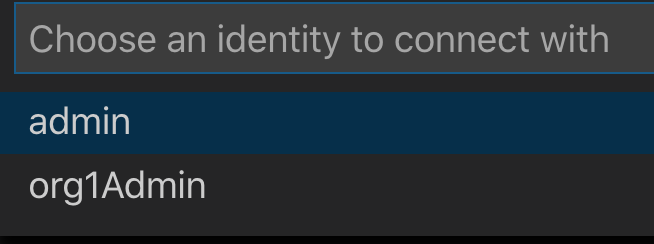
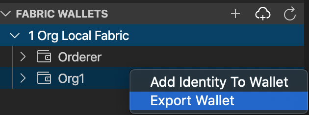
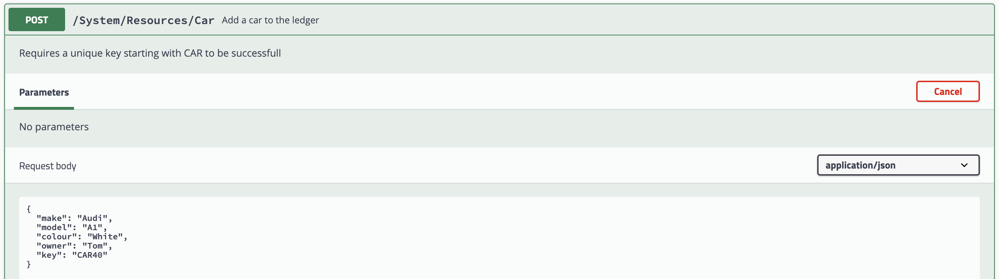
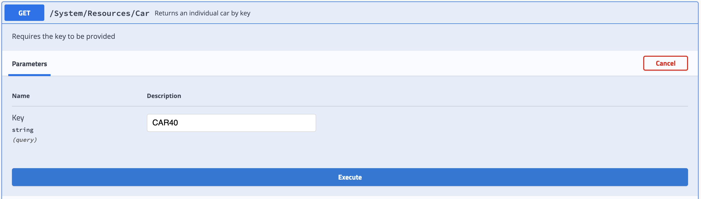
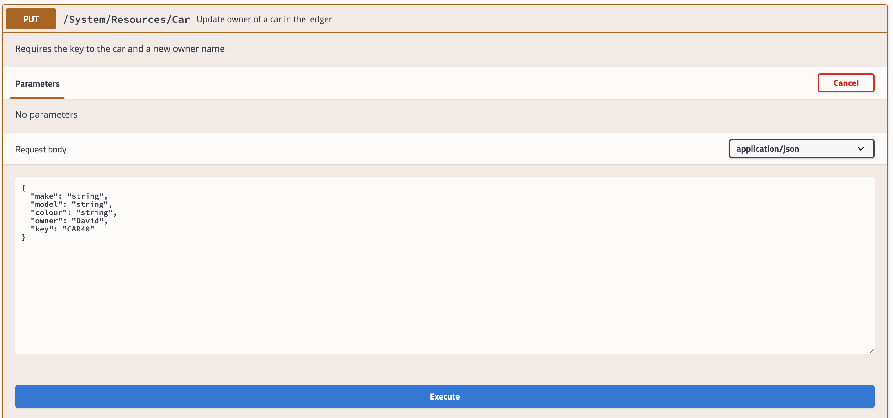

# Integrate Java microservices with blockchain using Hyperledger Fabric and Open Liberty

In this tutorial, learn how to:

* Install the IBM Blockchain Platform extension for Visual Studio (VS) Code
* Install the Open Liberty Tools for VS Code
* Use the IBM Blockchain Platform extension to create a local blockchain network and deploy a sample smart contract (based on cars)
* Use the Open Liberty Tools extension to start a web server that can communicate with your blockchain network
* Transact on the blockchain network from the web server using REST APIs

See how a blockchain network can be used to store data, while a client application sitting outside the blockchain network interacts with the data, querying and updating it. This is a common pattern in most blockchain projects, and Open Liberty makes it easy to achieve.

You will be able to execute different HTTP methods for various transactions from the Open Liberty server, and the blockchain network will return a response to the web browser. As a result, you will experience how easy the IBM developer tools make it to start up a blockchain network, as well as how promptly Open Liberty starts up as an application server, all while experiencing some of the great features included free within Open Liberty.

## Prerequisites

* Java
* Git
* Maven
* Docker
* VS Code

## What is blockchain?

Blockchain is a technology used to achieve a shared, immutable ledger between multiple parties. Some types of blockchain are open to anyone (for example, Ethereum main-net or Bitcoin), but many blockchain use cases require a network with access restricted to known entities.

When multiple companies would benefit from having the exact same data, but it's _not_ appropriate to agree that one of them owns a single master copy, a permissioned blockchain like [Hyperledger Fabric](https://www.hyperledger.org/projects/fabric) is a good solution. IBM Blockchain Platform developer tools and other offerings use Hyperledger Fabric as the underlying blockchain technology.

In this example, a simple sample `network` and `smart contract` will be used:

* The example network only has a single member and will run on your laptop. In a real scenario, there would be multiple members, and you would use a service like the [IBM Blockchain Platform](https://www.ibm.com/cloud/blockchain-platform) to run the network in containers or on a cloud platform.
* The example smart contract is based on recording basic information about cars to a ledger.

## What is Open Liberty?

[Open Liberty](https://openliberty.io/) is a lightweight, open source, cloud-native Java runtime. It is a web server used to handle requests for dynamic content, such as servlets, from web applications.

Open Liberty features include [Jakarta EE](http://jakarta.ee) and [Eclipse MicroProfile](https://microprofile.io/). Open Liberty is so lightweight that you only have to run what you need.

## Steps

* Get the development tools
* Import the Open Liberty project into VS Code
* Import the FabCar sample smart contract project into VS Code 

* Start the blockchain network and deploy the contract
* Export credentials to communicate with the blockchain network
* Start up Open Liberty server
* Query all items on the ledger
* Query specific items on the ledger
* Add cars to the ledger
* Update the owner of a car in the ledger
* Optional - View Open Liberty metrics
* Stop the Open Liberty server
* Stop the blockchain network

## 1 Get the development tools

1. If you have not already, download and install [Visual Studio Code](https://code.visualstudio.com/download).

1. Install the [IBM Blockchain Platform extension for VS Code](https://marketplace.visualstudio.com/items?itemName=IBMBlockchain.ibm-blockchain-platform).

   After installation, if any additional prerequisites are needed, the extension will guide you through installing them. Make sure you pick up the Docker prerequisites, as they will be used to create your Fabric network.

1. Install the [Open Liberty Tools for VS Code](https://marketplace.visualstudio.com/items?itemName=Open-Liberty.liberty-dev-vscode-ext).

## 2 Import the Open Liberty project into VS Code

1. Open a terminal window and clone the [sample project](https://github.com/IBM/Open-Liberty-Blockchain) in GitHub:

   `git clone https://github.com/IBM/Open-Liberty-Blockchain.git`

1. To add the current project to VS Code, select **File** > **Open** > **Open-Liberty-Blockchain**, and then click **Open**.

   This will add the project to the workspace and will automatically add `Liberty Dev Dashboard` into the VS Code extension.

## 3 Import the FabCar sample smart contract project into VS Code

1. Click the IBM Blockchain Platform icon in the top right corner (looks like a square).

   

    It may take a moment. In the purple bar at the bottom, it will say, "Activating extension."

1. Select **FabCar** from the "Explore sample code" section.

1. Click the **Clone** button to git clone the sample code for the FabCar sample, and choose a convenient location to clone the fabric sample.

1. Select **Clone**.

   

1. From the list of options choose, **FabCar v1.0.0 Java**.

1. Click **Open Locally**.

   

1. In the Command Palette, click **Add to workspace**.

1. *Optional*: Click the **File explorer** button in the top left, and you will see `fabcar-contract-java`, which is the project to create the blockchain network.

1. Click the IBM Blockchain Platform icon on the left side to navigate back to the IBM Blockchain Platform extension for VS Code.

## 4 Start the blockchain network and deploy the contract

1. Under **FABRIC ENVIRONMENTS**, select **1 Org Local Fabric o (click to start)**.

   This will start up Docker containers and configure the startup of the blockchain network. The first time will take approximately 3 - 5 minutes, as it pulls down the Docker images, starts up the containers, and configures the blockchain network.

1. Once you're connected to the "Local Fabric" environment (this happens automatically after it has started), under **Smart Contracts** > **Instantiated**, click **+Instantiate**.

1. Choose **fabcar-contract-java Open Project** (at the Command Palette prompt).

1. When prompted to "Enter a name for your Java Package," enter `fabcar`, and press **Enter**.

1. When prompted to "Enter a version for your Java package," enter `1.0.0`.

1. When "Optional functions" appears, enter `initLedger`. This initializes the ledger with cars. Not entering the function will result in the blockchain network being empty.

   

1. For all other "Optional functions", press **Enter** to skip.

1. When asked, "Do you want to provide a private data collection configuration file?," select **No**, as you do not need any private data configuration files.

The notification window at the bottom left will say, "IBM Blockchain Platform extension: Instantiating Smart Contract." It will take approximately 2 - 5 minutes to instantiate the smart contract.

## 5 Export credentials to communicate with the blockchain network

For Open Liberty to communicate to the blockchain network, Hyperledger Fabric has security features that stop applications attempting to make transactions unless you have the specific profiles and certificate authorities.

1. Export the Local Fabric Gateways:

   1. In the "FABRIC GATEWAYS" panel, select `1 Org Local Fabric - Org1`.

   1. "Choose an identity to connect with" will appear from the command palette. Select **admin**.

      

   1. Hover over the **FABRIC GATEWAYS** heading, click **...** > **Export connection profile**.

      

   1. The `finder` window will open.

   1. Navigate to `Users/Shared/`.
      > If on Windows operating system navigate to `C:/Users/Public/`.

   1. Create a new folder `FabConnection`.

      The full path directory should be `Users/Shared/FabConnection`.
      > On Windows the full path directory is `C:/Users/Public/FabConnection`.

   1. Save the `.json` file as `1-Org-Local-Fabric-Org1_connection.json`.

1. Export the Fabric Wallets:

   1. In the "FABRIC WALLETS" panel, select **1 Org Local Fabric**, then right-click **Org1**, and select **Export Wallet**.

      

   1. Save the folder as `wallet` in the `/Users/Shared/FabConnection/` directory.
      > On windows `C:/Users/Public/FabConnection/`

## 6 Start up the Open Liberty server

1. As we installed the `Dev Tool` for Open Liberty, click the **Liberty Dev Dashboard** icon, and the extension will display the project: `ol-blockchain`.

1. Right-click **ol-blockchain**, and select **Start**.

   

   This will quickly start up the application server up -- usually within 2 - 5 seconds.

   

## 7. Query all ledger state

One of the features we are highlighting is MicroProfile OpenAPI. You will be able to execute HTTP methods such as `POST`, `GET`, and `PUT`. You will use all three in the example.

1. Open up a web browser and navigate to:

   `http://localhost:9080/openapi/ui/`

   This will display all the possible operations you can execute to the blockchain network.

   The OpenAPI feature shows which HTTP response is being showcased. Querying all cars on the ledger is a `GET` request.

   

   If you are keen, you can see the output on the terminal window in VS Code, where it's the same output. This is useful to see if the request has not worked, as you can see the `stack trace` error.

1. Navigate to **GET /System/Resources/Cars Returns all cars** > **Try it out** > **Execute**.

   It will send a request to the Ledger and return back all cars.

   The successful response should look like:

   ```json
   Queried all Cars Successfully.
   Cars:
   [{"make":"Toyota","model":"Prius","colour":"blue","owner":"Tomoko"}}]
   ```

## 8 Add a car to the ledger

1. Navigate to **POST /System/Resources/Car Add a car to the ledger**.

1. Click **Try it out**.

1. Fill in the example schema with the following values, as illustrated in the figure:

   ```
   {
     "make": "Audi",
     "model": "A1",
     "colour": "White",
     "owner": "Tom"
     "key": "CAR40"
   }
   ```

   

## 9 Query a specific car on the ledger

There is an ID for each item on the ledger, making the item unique. This is very useful if you want to query specific items on the ledger. To query specific cars on the ledger:

1. In the OpenAPI UI, select **GET /System/Resources/Car Returns an individual car by key**.

   

1. Query the recently added car by inserting the ID and clicking **Execute**.

The successful response should look like:

   ```json
   Queried car Successfully.
   Key = CAR40
   Details = {"make":"Audi","model":"A1","colour":"White","owner":"Tom"}
   ```

## 10 Update owner of a car in the ledger

1. Navigate to **PUT /System​/Resources​/Car Update owner of a car in the ledger**.

1. Click **Try it out**.

1. Fill in the example schema with the following values, as illustrated in the figure:

   ```
   {
     "make": "string",
     "model": "string",
     "colour": "string",
     "owner": "David"
     "key": "CAR40"
   }
   ```

   

1. Re-query `CAR40` to see the updated owner

## 11 Optional: View Open Liberty metrics

You can monitor metrics using another useful MicroProfile feature to determine the performance of a service.

To view the time it takes to execute a transaction:

1. Navigate to:

   `https://localhost:9443/metrics/application`

2. Authentication is required to view the metrics. When prompted, enter the username and password.

   Username: `admin`<br/>
   Password: `adminpwd`

Within the code, the `@Timed` annotation is implemented so that when a transaction is executed, a timer starts. This is useful, as you can see how fast it takes to retrieve the cars from the blockchain network when you execute `QueryAllCars`.


The list provides you a summary. For example, `application_QueryCarsProcessingTime_seconds_count{method="GET"} 2` means that the `GET` method has been called twice. The time it takes in `seconds` to execute the transaction is below it.

You can view the other transaction metrics, under the `# Help` summaries.

For example, metrics for updating the cars owner:

`# HELP application_UpdateCarProcessingTime_seconds Time needed to update car in the inventory`

```
application_UpdateCarProcessingTime_seconds_count{method="put"} 1
application_UpdateCarProcessingTime_seconds{method="put",quantile="0.5"} 5.347197288
application_UpdateCarProcessingTime_seconds{method="put",quantile="0.75"} 5.347197288
application_UpdateCarProcessingTime_seconds{method="put",quantile="0.95"} 5.347197288
application_UpdateCarProcessingTime_seconds{method="put",quantile="0.98"} 5.347197288
application_UpdateCarProcessingTime_seconds{method="put",quantile="0.99"} 5.347197288
application_UpdateCarProcessingTime_seconds{method="put",quantile="0.999"} 5.347197288
```

## 12 Stop the Open Liberty server

Once you have finished, go back to VS Code > Liberty Dev Dashboard, and press **Stop**. This will stop the Open Liberty server.

Now, the server is off and the application is not running anymore. If you tried to hit one of the endpoints, it would not find it.

## 13 Tear down the blockchain network

*Optional*: You can stop the blockchain network, and save the state on the ledger if you decide to come back to it later. Click the IBM Blockchain Platform icon on the left side. On Fabric Environments, select **...** > **Stop Fabric Environment**.

1. You can easily start it again by clicking `1 Org Local Fabric`.

To remove the Docker images where it is running, on Fabric Environments click **...** > **Teardown Fabric Environment**.

## Conclusion

In this tutorial, you have experienced using two IBM open-source-contributed products. You have learned what blockchain is and what an application server is. You have also experienced making transactions to a ledger and adding to a ledger.